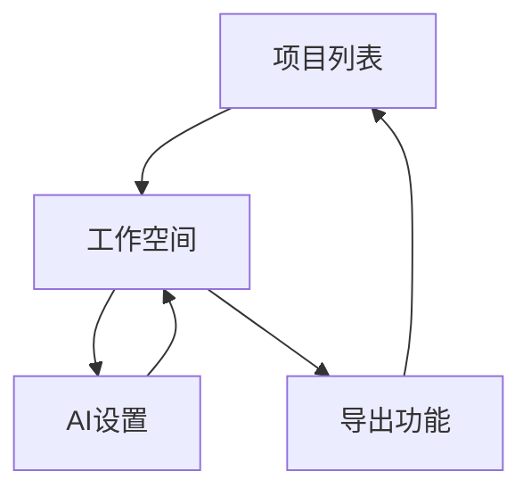

# 智能推理图工作空间产品需求文档

## 1. 产品概述

智能推理图工作空间是一个专为研究人员设计的可视化工具，将线性对话转化为结构化的推理图。通过AI驱动的推理引擎，帮助用户将复杂的研究问题分解为多个推理分支，实现人机协作的深度思考过程。

产品核心价值在于提升研究效率，让用户能够直观地探索不同假设，比较推理结果，并导出完整的推理树用于学术写作和决策支持。

## 2. 核心功能

### 2.1 功能模块

推理图工作空间包含以下核心功能：

1. **工作空间**: 无限画布、节点系统、AI推理面板、导出功能
2. **项目管理**: 项目列表、创建新项目、加载已有项目
3. **AI设置**: 模型配置、API密钥管理

### 2.2 核心特性

| 功能类别   | 功能描述                          |
| ------ | ----------------------------- |
| 画布系统   | 无限画布、拖拽缩放、节点放置和连接             |
| 节点系统   | 创建问题节点、推理节点、假设节点、分支节点、结论节点    |
| AI推理引擎 | 调用OpenRouter API生成推理计划、执行分支推理 |
| 实时编辑   | 双击编辑节点内容、右键创建分支、拖拽调整连接        |
| 导出功能   | 一键导出JSON/Markdown格式的推理树       |

## 3. 核心流程

### 3.1 研究工作流程

1. **项目创建**: 用户输入研究问题，选择AI模型
2. **推理计划生成**: AI分析问题并生成结构化推理步骤
3. **可视化布局**: 自动在画布上创建和排列节点
4. **分支探索**: 用户在不同节点创建分支，并行探索多个假设
5. **实时编辑**: 用户编辑节点内容，添加人工见解
6. **结果导出**: 导出完整的推理树用于进一步分析

### 3.2 功能导航



## 4. 用户界面设计

### 4.1 设计风格

* **主色调**: 深蓝色(#1e40af)搭配白色背景，突出专业性

* **节点颜色**: 问题节点(紫色#7c3aed)、推理节点(蓝色#3b82f6)、假设节点(橙色#f59e0b)、分支节点(绿色#10b981)、结论节点(红色#ef4444)

* **按钮样式**: 圆角矩形，悬停效果，清晰的视觉层次

* **字体**: Inter字体，标题20px，正文16px，注释14px

* **布局**: 卡片式设计，左侧工具面板，中央画布，右侧详情面板

### 4.2 界面布局

| 区域    | 功能描述                             |
| ----- | -------------------------------- |
| 顶部工具栏 | 项目名称居中显示，右侧导出按钮和视图控制(放大/缩小/重置)   |
| 左侧面板  | 节点类型选择器(图标+文字)、AI模型设置下拉菜单、项目操作按钮 |
| 中央画布  | 无限画布背景网格、可拖拽节点、连接线、缩放控制          |
| 右侧面板  | 选中节点详情编辑器、AI响应预览、节点属性设置          |

### 4.3 桌面端优化

* **桌面优先**: 专为桌面用户设计，优化大屏幕体验

* **键盘快捷键**: 支持常用操作的快捷键

* **鼠标操作**: 优化拖拽、右键菜单、滚轮缩放等交互

* **窗口布局**: 可调整面板大小，支持全屏模式

## 5. 技术实现要求

### 5.1 前端技术栈

* **框架**: React 18 + TypeScript

* **画布库**: tldraw (无限画布、节点编辑)

* **样式**: Tailwind CSS + 自定义组件

* **状态管理**: React Context + useReducer

* **HTTP客户端**: Axios

* **构建工具**: Vite

### 5.2 后端技术栈

* **运行时**: Node.js

* **框架**: Express.js

* **AI集成**: OpenRouter SDK

* **内存存储**: 项目状态管理

* **CORS**: 支持跨域请求

### 5.3 AI集成要求

* **API支持**: OpenRouter平台，支持openai/gpt-5和google/gemini-2.5-pro

* **Prompt工程**: 结构化输出，包含推理步骤、假设识别、结论生成

* **上下文管理**: 智能压缩长对话，保留关键决策点

* **并行处理**: 支持多分支同时推理，响应时间<3秒

## 6. 性能要求

### 6.1 响应时间

* AI推理响应: <3秒

* 节点创建/编辑: <100ms

* 画布操作: 60fps流畅体验

* 导出功能: <2秒

### 6.2 容量限制

* 单项目节点数量: 1000个以内

* 并行分支数量: 5个以内

* 浏览器兼容性: Chrome 90+, Firefox 88+, Safari 14+

### 6.3 内存使用

* 前端内存占用: <200MB

* 后端单项目内存: <50MB

## 7. 数据格式

### 7.1 节点数据结构

```typescript
interface ReasoningNode {
  id: string;
  type: 'question' | 'reasoning' | 'hypothesis' | 'branch' | 'conclusion';
  content: string;
  position: { x: number; y: number };
  connections: string[];
  metadata: {
    createdAt: Date;
    updatedAt: Date;
    aiGenerated: boolean;
    confidence?: number;
  };
}
```

### 7.2 项目数据结构

```typescript
interface ReasoningProject {
  id: string;
  name: string;
  aiModel: string;
  nodes: ReasoningNode[];
  createdAt: Date;
  updatedAt: Date;
}
```

## 8. MVP功能清单

### 8.1 必须实现

* ✅ 基础画布和节点系统

* ✅ AI推理集成（通过OpenRouter）

* ✅ 简单的分支创建（2-3个分支）

* ✅ 节点编辑功能

* ✅ JSON/Markdown导出

* ✅ 项目管理（本地存储）

### 8.2 用户体验要求

* 用户能在3分钟内理解基本操作

* 拖拽、编辑、创建操作直观流畅

* 视觉反馈清晰，状态指示明确

* 导出文档结构清晰，易于使用

## 9. 成功标准

### 9.1 功能完整性

* ✅ 基础画布和节点系统正常运行

* ✅ AI推理集成成功，响应时间符合要求

* ✅ 支持2-3个分支创建和管理

* ✅ 节点编辑功能流畅可用

* ✅ JSON/Markdown导出功能完整

### 9.2 技术质量

* 代码结构清晰，模块化程度高

* 错误处理完善，用户操作有反馈

* 性能优化到位，无明显卡顿

* 文档齐全，便于后续维护

## 10. 风险与限制

### 10.1 技术风险

* AI API调用可能因网络问题失败

* 大规模节点可能导致性能下降

* 浏览器兼容性可能存在差异

### 10.2 功能限制

* 单用户系统，不支持协作

* 无用户认证，项目存储在本地

* 专注于桌面端，不支持移动端

* 内存存储，重启后数据丢失

