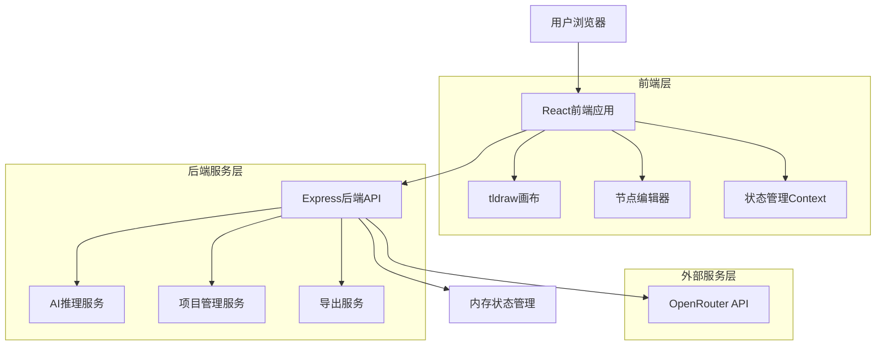
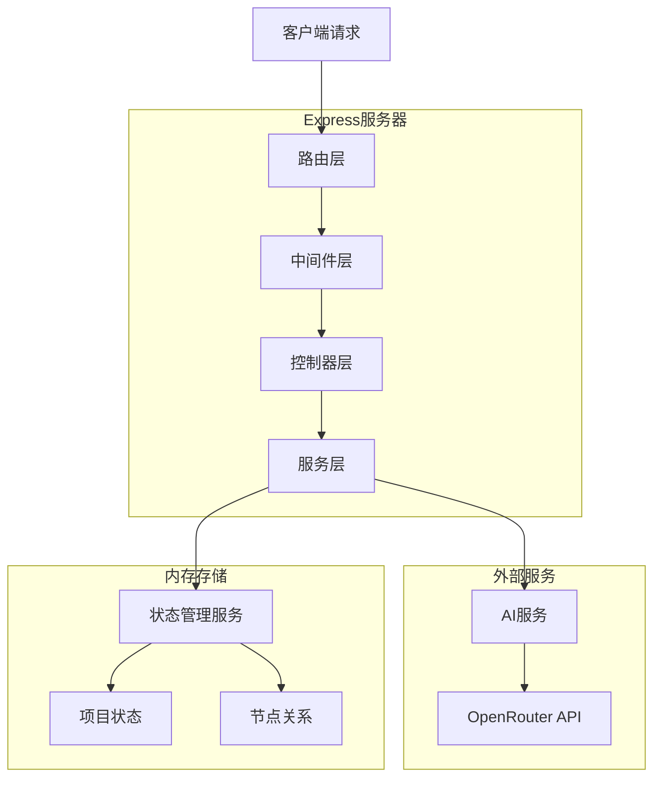
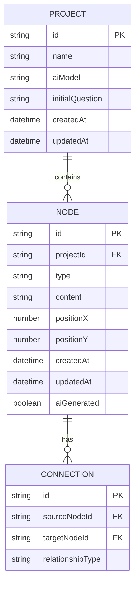

# 智能推理图工作空间技术架构文档

## 1. 架构设计



## 2. 技术栈描述

### 2.1 前端技术栈
- **框架**: React@18 + TypeScript
- **UI库**: Tailwind CSS@3
- **画布引擎**: tldraw@2.0
- **HTTP客户端**: Axios
- **构建工具**: Vite
- **状态管理**: React Context + useReducer
- **图标库**: Lucide React

### 2.2 后端技术栈
- **运行时**: Node.js@18
- **框架**: Express@4
- **AI集成**: OpenRouter SDK
- **CORS**: cors@2.8
- **环境变量**: dotenv@16
- **开发工具**: nodemon@3

### 2.3 初始化工具
- **前端**: vite-init (React + TypeScript + Tailwind)
- **后端**: npm init (Express + TypeScript)

## 3. 路由定义

### 3.1 前端路由
| 路由 | 用途 |
|------|------|
| / | 项目管理页面，显示所有推理项目 |
| /workspace/:projectId | 工作空间页面，主要编辑区域 |
| /settings | 设置页面，配置AI模型和偏好 |

### 3.2 后端API路由
| 路由 | 方法 | 用途 |
|------|------|------|
| /api/projects | GET | 获取所有项目列表 |
| /api/projects | POST | 创建新项目 |
| /api/projects/:id | GET | 获取特定项目详情 |
| /api/projects/:id | PUT | 更新项目数据 |
| /api/projects/:id | DELETE | 删除项目 |
| /api/reasoning/plan | POST | 生成推理计划 |
| /api/reasoning/branch | POST | 执行分支推理 |
| /api/export/json | POST | 导出JSON格式 |
| /api/export/markdown | POST | 导出Markdown格式 |

## 4. API定义

### 4.1 项目相关API

#### 创建项目
```
POST /api/projects
```

请求参数：
| 参数名 | 类型 | 必需 | 描述 |
|--------|------|------|------|
| name | string | 是 | 项目名称 |
| aiModel | string | 是 | AI模型选择 |
| initialQuestion | string | 是 | 初始研究问题 |

响应：
| 参数名 | 类型 | 描述 |
|--------|------|------|
| id | string | 项目唯一标识 |
| name | string | 项目名称 |
| aiModel | string | 选定的AI模型 |
| createdAt | string | 创建时间 |

示例：
```json
{
  "name": "气候变化影响研究",
  "aiModel": "openai/gpt-5",
  "initialQuestion": "全球气候变化对农业生产的影响机制是什么？"
}
```

#### 生成推理计划
```
POST /api/reasoning/plan
```

请求参数：
| 参数名 | 类型 | 必需 | 描述 |
|--------|------|------|------|
| projectId | string | 是 | 项目ID |
| question | string | 是 | 研究问题 |
| context | string | 否 | 额外上下文 |

响应：
| 参数名 | 类型 | 描述 |
|--------|------|------|
| nodes | array | 推理节点数组 |
| connections | array | 节点连接关系 |

### 4.2 AI推理相关API

#### 分支推理
```
POST /api/reasoning/branch
```

请求参数：
| 参数名 | 类型 | 必需 | 描述 |
|--------|------|------|------|
| projectId | string | 是 | 项目ID |
| parentNodeId | string | 是 | 父节点ID |
| branchContext | string | 是 | 分支上下文 |
| hypothesis | string | 是 | 假设内容 |

响应：
| 参数名 | 类型 | 描述 |
|--------|------|------|
| newNode | object | 生成的推理节点 |
| reasoningPath | array | 推理路径 |

### 4.3 导出相关API

#### 导出Markdown
```
POST /api/export/markdown
```

请求参数：
| 参数名 | 类型 | 必需 | 描述 |
|--------|------|------|------|
| projectId | string | 是 | 项目ID |
| format | string | 否 | 导出格式标准 |

## 5. 服务器架构



## 6. 数据模型

### 6.1 数据模型定义



### 6.2 数据定义语言

#### 项目表结构（内存存储）
```typescript
interface Project {
  id: string;                    // 项目唯一标识
  name: string;                  // 项目名称
  aiModel: string;              // AI模型选择
  initialQuestion: string;      // 初始研究问题
  nodes: Node[];                // 节点数组
  createdAt: Date;              // 创建时间
  updatedAt: Date;              // 更新时间
}
```

#### 节点表结构
```typescript
interface Node {
  id: string;                   // 节点唯一标识
  projectId: string;            // 所属项目ID
  type: NodeType;               // 节点类型
  content: string;              // 节点内容
  position: {                   // 位置坐标
    x: number;
    y: number;
  };
  connections: string[];      // 连接的节点ID数组
  metadata: {                   // 元数据
    createdAt: Date;
    updatedAt: Date;
    aiGenerated: boolean;
    confidence?: number;
    author?: string;
  };
}
```

#### 节点类型枚举
```typescript
enum NodeType {
  QUESTION = 'question',        // 问题节点
  REASONING = 'reasoning',      // 推理节点
  HYPOTHESIS = 'hypothesis',    // 假设节点
  BRANCH = 'branch',            // 分支节点
  CONCLUSION = 'conclusion'     // 结论节点
}
```

### 6.3 内存存储实现

#### 项目存储管理器
```typescript
class ProjectManager {
  private projects: Map<string, Project> = new Map();
  
  createProject(data: CreateProjectDto): Project {
    const project: Project = {
      id: generateId(),
      ...data,
      nodes: [],
      createdAt: new Date(),
      updatedAt: new Date()
    };
    this.projects.set(project.id, project);
    return project;
  }
  
  getProject(id: string): Project | undefined {
    return this.projects.get(id);
  }
  
  updateProject(id: string, updates: Partial<Project>): Project | undefined {
    const project = this.projects.get(id);
    if (project) {
      Object.assign(project, updates, { updatedAt: new Date() });
    }
    return project;
  }
  
  deleteProject(id: string): boolean {
    return this.projects.delete(id);
  }
  
  getAllProjects(): Project[] {
    return Array.from(this.projects.values());
  }
}
```

## 7. AI集成设计

### 7.1 OpenRouter API封装

```typescript
import OpenRouter from 'openrouter';

class AIService {
  private client: OpenRouter;
  
  constructor(apiKey: string) {
    this.client = new OpenRouter({
      apiKey: apiKey,
      baseURL: "https://openrouter.ai/api/v1"
    });
  }
  
  async generateReasoningPlan(question: string, context?: string): Promise<ReasoningPlan> {
    const prompt = this.buildPlanningPrompt(question, context);
    
    const response = await this.client.chat.completions.create({
      model: "openai/gpt-5",
      messages: [{ role: "user", content: prompt }],
      temperature: 0.7,
      max_tokens: 2000
    });
    
    return this.parseReasoningPlan(response.choices[0].message.content);
  }
  
  async generateBranchReasoning(
    parentContext: string,
    hypothesis: string,
    branchContext: string
  ): Promise<BranchReasoning> {
    const prompt = this.buildBranchPrompt(parentContext, hypothesis, branchContext);
    
    const response = await this.client.chat.completions.create({
      model: "openai/gpt-5", 
      messages: [{ role: "user", content: prompt }],
      temperature: 0.8,
      max_tokens: 1500
    });
    
    return this.parseBranchReasoning(response.choices[0].message.content);
  }
}
```

### 7.2 Prompt设计

#### 推理计划生成Prompt
```
你是一个研究助手，需要帮用户将复杂的研究问题分解为结构化的推理步骤。

研究问题：{question}
背景信息：{context}

请提供以下结构化输出：
1. 问题分解（3-5个主要方面）
2. 关键假设识别（每个方面的核心假设）
3. 推理路径规划（从问题到结论的逻辑步骤）
4. 预期结论类型（可能的结论形式）

输出格式为JSON：
{
  "decomposition": ["方面1", "方面2", "方面3"],
  "assumptions": {
    "方面1": ["假设1", "假设2"],
    "方面2": ["假设1", "假设2"]
  },
  "reasoning_steps": [
    {"step": 1, "description": "步骤描述", "type": "question"},
    {"step": 2, "description": "步骤描述", "type": "reasoning"}
  ],
  "expected_conclusions": ["结论类型1", "结论类型2"]
}
```

## 8. 性能优化策略

### 8.1 前端优化

- **虚拟化**: 对大型画布实现虚拟滚动
- **防抖**: 用户输入防抖处理，减少API调用
- **懒加载**: 节点详情面板懒加载
- **缓存**: 本地缓存AI响应结果
- **批处理**: 合并多个节点更新操作

### 8.2 后端优化

- **连接池**: AI API连接池管理
- **并发控制**: 限制同时进行的AI请求数量
- **缓存策略**: 缓存相似问题的推理结果
- **批处理**: 合并多个推理请求
- **超时管理**: 设置合理的API调用超时时间

## 9. 安全考虑

### 9.1 API安全

- **密钥管理**: 环境变量存储API密钥
- **请求验证**: 输入参数验证和清理
- **速率限制**: 实现API调用频率限制
- **错误处理**: 不暴露敏感错误信息

### 9.2 数据安全

- **内存隔离**: 不同用户项目数据隔离
- **清理机制**: 定期清理过期项目数据
- **输入过滤**: 防止XSS攻击
- **CORS配置**: 严格的跨域请求控制

## 10. 部署配置

### 10.1 环境变量
```bash
# AI服务配置
OPENROUTER_API_KEY=your_api_key_here
DEFAULT_AI_MODEL=openai/gpt-5

# 服务器配置
PORT=3001
NODE_ENV=development

# 性能配置
MAX_CONCURRENT_AI_REQUESTS=5
AI_REQUEST_TIMEOUT=30000
PROJECT_EXPIRY_HOURS=24
```

### 10.2 构建配置
```json
{
  "scripts": {
    "dev": "concurrently \"npm run dev:frontend\" \"npm run dev:backend\"",
    "dev:frontend": "cd frontend && npm run dev",
    "dev:backend": "cd backend && npm run dev",
    "build": "npm run build:frontend && npm run build:backend",
    "